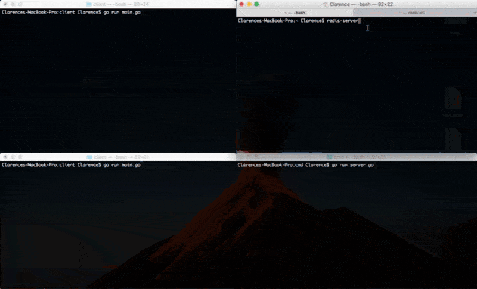

# console-chat

A project designed to learn about **Go**, **gRPC** and **Redis Pub/Sub**.

The application has a server where many clients can connect to in order to send messages back and forth through Redis as a message broker.

The publisher/subscriber model allows clients to subscribe to the server, while the server publishes incoming client requests back out.

## Demo

## Installation
Set up a redis server (instructions found [here](https://redis.io/topics/quickstart)) and make the necessary configurations in the server/clients to point towards the correct port.

Get the generated code using `go get -u github.com/clarencejychan/consolechat-grpc`

Run `go run server.go` or `go build server.go` in `console-chat/server/cmd` and run the binary.

Run `go run client.go` or `go build client.go` in `console-chat/client` and run the binary on as many consoles as you would like.

Follow the prompts on the screen and try typing into the client consoles!

